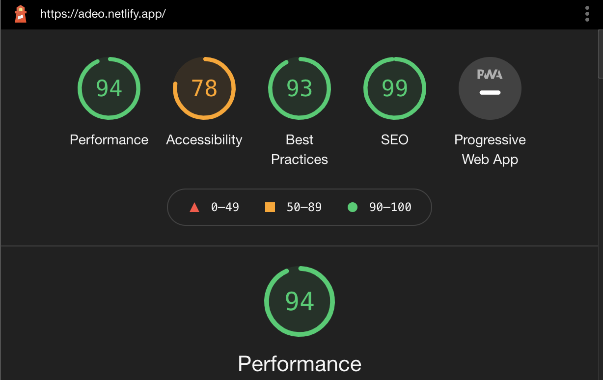

# Adeo Webstore
A Webstore for Minimal Clothes


## Lighthouse



## Getting Started

1. Install the project dependencies
```shell
npm install
```

2. Run the application
```shell
npm run start
```

## Component map
    -Pagehome
    -PageShop
        -Header
        -Products
        -ProductList
        -Layout
        -footer

## Languages Used

    - HTML 5
    - CSS3
    - Javascript
    - ReactJS

## Database Technology
    - Firebase

## URL 
https://adeo.netlify.app/
